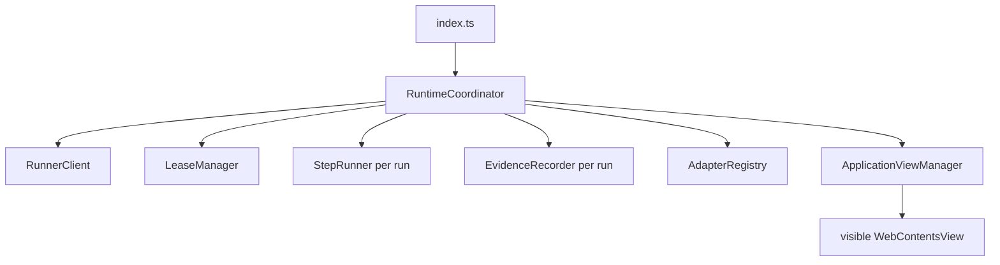

# CROSS-012 production runtime evidence

**Date:** 2026-08-20  
**Branch:** `development`  
**Approval status:** remains `READY` in `docs/work-orders/STATUS.md` (the Work Order file still says `BLOCKED`; that is stale).

## Production composition

Process-level objects are constructed in `apps/desktop/src/main/index.ts`:

- `new RunnerClient(...)`
- `new LeaseManager(client)`
- `new RuntimeCoordinator({ config, viewManager, client, leaseManager, adapterRegistry: createDefaultAdapterRegistry() })`

Per-run objects are constructed only inside `apps/desktop/src/main/runtime/coordinator.ts`:

- `new StepRunner(...)`
- `new EvidenceRecorder(...)`



`rg -n "new (StepRunner|LeaseManager|RunnerClient|EvidenceRecorder)" apps/desktop/src/main` locates those construction sites. There is no static import-graph shim; `test:production` launches compiled `dist/main/index.js` and fails if the coordinator is not on that path.

## Production smoke (real Electron, `dist/main/index.js`)

Runs created only via `POST /api/v1/application-runs`. Trusted renderer calls `openApplication` over production IPC.

| Case | Result |
| --- | --- |
| Generic authorized full-auto | submitted |
| Greenhouse authorized full-auto | submitted (`platform_adapter_id=greenhouse`) |
| Lever authorized full-auto | submitted (`platform_adapter_id=lever`) |
| Generic semi-auto | `submit_armed` + view surrender, owner `release-submit`, then submitted |

Identity fields that the answer policy classifies as `unrecognized_intent` pause as `unresolved_question` / `needs_input`. The smoke resolves those through the public `resolve-answers` contract, then reopens the same run. Full-auto still does not call `release-submit`. Semi-auto still requires it.

## Coordinator unit evidence (`tests/runtime/coordinator.test.ts`)

- View refusal at/past submitting (`VIEW_LOCKED_SUBMITTING`)
- Visible URL mismatch (`URL_MISMATCH`)
- Unauthorized full-auto surfaced as `UNAUTHORIZED_FULL_AUTO` (no silent drop)
- Crash while submitting completes `submission_unknown`

Lease loss and step-loop exhaustion are implemented in `coordinator.ts` (`LEASE_LOST`, `STEP_EXHAUSTED`). Duplicate submit uses `submitAlreadyAttempted` → reconcile, never a second activation.

## Semi-auto view surrender (D-1)

At `READY_FOR_REVIEW` in semi-auto the coordinator records `submit_armed`, raises `semi_auto_armed`, forgets the lease, closes the embedded view, and dequeues **other** runs only. Reclaim after `release-submit` uses `claimed`/`running` + `submit_armed` as released (claim changes status off `queued`).

## Isolation / redaction

- ATS `WebContentsView` stays sandboxed, no preload.
- Trusted preload may only `require("electron")`; IPC channel names are inlined so the sandbox can load it.
- Runtime-state IPC carries `runId`, `phase`, `status`, `checkpoint`, `automationMode`, `adapterId`, `reasonCode`, `blockingFieldCount` only.

## Reconciled omissions (not owner decisions)

- `vitest.config.mts` `production` project (D-6) so `tests/production/**` runs.
- `AdapterRegistry.adapterById()` so the named `platform_adapter_id` binds when the visible host is loopback. Adapter selection is URL-first: the visible host decides, then the frozen canonical URL, and only a loopback page may fall back to the backend-named adapter. See "Post-review corrections" below.
- Fixture seed `policy_snapshot` so BACK-012 submit gates do not 409 real-backend lifecycle tests.
- Sandboxed preload cannot import `../shared/contracts` at runtime.

## Validation transcript (2026-08-20)

```text
corepack pnpm --filter @job-engine/desktop run check          # pass
corepack pnpm --filter @job-engine/desktop run test           # 289 passed
corepack pnpm --filter @job-engine/desktop run test:fixtures  # 7 passed
corepack pnpm --filter @job-engine/desktop run test:production # 4 passed
corepack pnpm --filter @job-engine/desktop run build          # pass
rg construction sites in apps/desktop/src/main                # index.ts + coordinator.ts
git diff --check                                              # clean
```

## Post-review corrections (2026-08-20)

Two defects found reviewing commit `628574e` against
[`CROSS-012-plan-review.md`](../work-orders/cross-repo/CROSS-012-plan-review.md),
fixed on top of it.

### Truthful reason code for a retryable step failure

`mapOutcome` reported `FAILED_RETRYABLE` as reason code `LEASE_LOST`, which
names a cause that did not occur. FRONT-006 renders `reasonCode` as the
explanation for a pause, so the owner would have been told the lease was lost
whenever a step failed retryably — the kind of untruthful state V2.1 outcome 5
forbids. Added `STEP_RETRYABLE` to `RuntimeReasonCode` and mapped
`FAILED_RETRYABLE` to it. `LEASE_LOST` now means only a lost lease.

### Adapter selection is URL-first, with the named adapter confined to loopback

`selectAdapter` fell back to `adapterRegistry.adapterById(run.platform_adapter_id)`
for any page whose visible host resolved to `generic` or to nothing — not only
for the loopback fixture servers this evidence file originally described. On a
public host that no platform adapter matches, a backend row naming `greenhouse`
would have driven Greenhouse selectors against a page that never matched them.
The visible URL is checked against the backend-resolved run before this point,
so this was never reachable from remote content, and `detect()` would normally
fail closed — but the documented guard did not exist in the code.

Selection order is now explicit:

1. The visible URL, when it matches a platform adapter.
2. The frozen `canonical_application_url`, when it matches a platform adapter —
   still a URL decision, made against the real posting address.
3. The backend-named adapter, **only** when the visible page is loopback
   (`localhost`, `::1`, `127.0.0.0/8`, parsed with `URL` and compared by exact
   hostname).
4. Otherwise the generic adapter, or nothing.

Four cases in `tests/runtime/coordinator.test.ts` cover this, including that a
run naming `greenhouse` on an unmatched public host resolves to `generic`
rather than Greenhouse.

Revalidated: `check` passes; `test` passes with 293 tests (289 + 4 new).
`test:production` was not re-run for these changes — neither touches the smoke
path, and no disposable PostgreSQL was available at review time.
